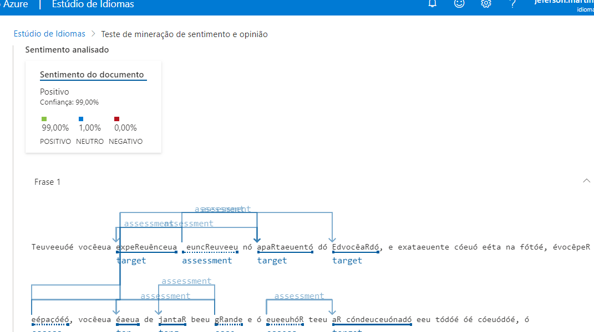
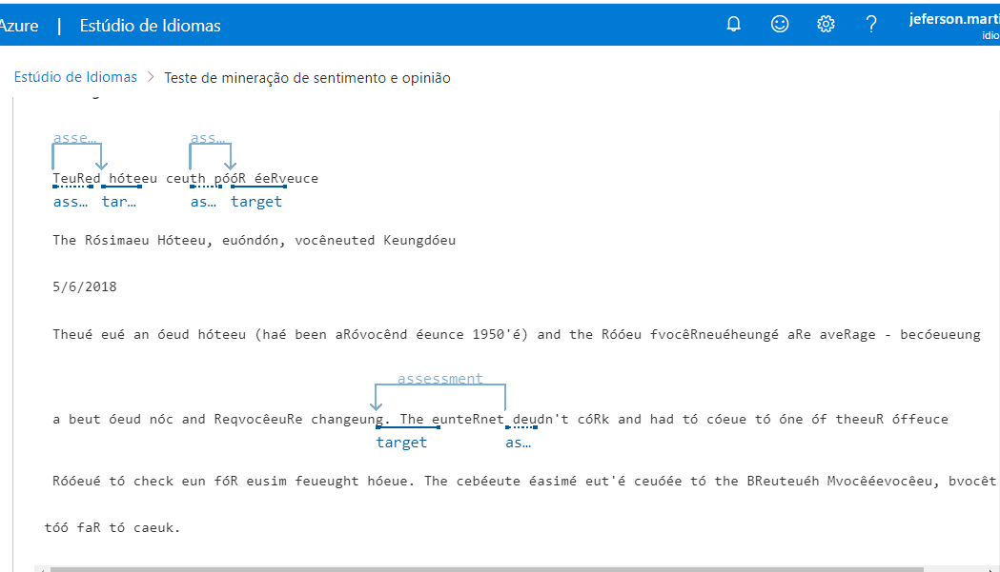

# Conversão de fala em texto com Speech Stúdio e análise de sentimentos com Language Studio, ambos recursos do IA Azure

## Speech to text

O serviço Azure AI Speech transcreve a fala em texto e o texto em fala audível. Você pode usar o AI Speech para criar um aplicativo que possa transcrever notas de reuniões ou gerar texto a partir da gravação de entrevistas.

### Vá no portal da [Azure](https://portal.azure.com/?azure-portal=true), criar recurso, em serviços de IA do Azure, criar, e siga as instruções dessa [Documentação](https://microsoftlearning.github.io/mslearn-ai-fundamentals/Instructions/Labs/09-speech.html) e siga as instruções para fazer seus testes.

Excelente ferramenta para legendas simultâneas seja em reuniões com multinacionais, entrevistas em outro país ou assistir um vídeo que se deseja ter legendas.

Neste projeto foi utilizado dois áudios de voz como exemplo e foram convertidos em texto. para ver os resultados abra o arquivo de texto na pasta inputs.

## Análise de Sentimentos

Exploraremos recursos da linguagem Azure AI analisando alguns exemplos de avaliações de hotéis. Você usará o Language Studio para entender se as avaliações são em sua maioria positivas ou negativas (ver exemplos em inputs).

O Processamento de Linguagem Natural (PNL) é um ramo da IA ​​que lida com a linguagem escrita e falada. Você pode usar a PNL para construir soluções que extraiam significado semântico de texto ou fala, ou que formulem respostas significativas em linguagem natural.

### Vá no portal da [Azure](https://portal.azure.com/?azure-portal=true), criar recurso, em serviços de IA do Azure, criar, e siga as instruções dessa [Documentação](https://microsoftlearning.github.io/mslearn-ai-fundamentals/Instructions/Labs/06-text-analysis.html) e siga as instruções.

.png)

Copie e cole ou digite seu próprio texto e limpe a caixa de texto para novas análises.

.png)

Carregue um arquivo se preferir, confirme e aceite que ocorrerá um custo e execute.

A análise é feita em cada frase minerando termos e palavras chaves, tendo como resultado uma portcentagem para positivo, negativo e neutro

.png>)

Logo no início é o mostrado o sentimento do texto inteiro. 

-1.png)

E depois o sentimento de cada frase.

Análise de palavras chaves.

Em uma rede nacional ou mundial como a de hotéis por exemplo, essa ferramenta de análise de sentimentos se faz totalmente necessária e eficaz onde a avaliação do anfitrão fará diferença na hora de alugar um quarto.
Outras redes como as de e-comerce e prestação de serviços diversos se beneficiam do uso dessa ferramenta.

### Referências

DIO.

Portal Azure